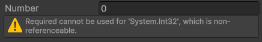

# Required

`Unity 2022.3 (or higher)`
`.NET Standard 2.1`
`C# 9.0`

## Overview


One of the most common errors in any Unity project are the 
[`NullReferenceException`](https://learn.microsoft.com/en-us/dotnet/api/system.nullreferenceexception?view=net-9.0), 
haunting developers nightmares. This package makes it easier to spot when a serialized fields in the Unity Editor is 
left empty, even though they should be set. With this new `[Required]` attribute, you (as a software developer) can be 
sure required fields in the Unity Editor are communicate with your team members, no matter what.

## Installation instructions

- Open the [Package Manager](https://docs.unity3d.com/Manual/upm-ui.html) in a Unity project.
- Click on the "+" button to add a new package.
- Click on "Install package from git URL...".
- Put in `https://github.com/Incantium/Required.git`.
- Click on "Install" or press enter.
- Enjoy!

## Limitations

- It is impossible to reference classes that cannot be referenced through the Unity Editor (that do not inherit from
  [Object](https://docs.unity3d.com/ScriptReference/Object.html) or [IRequireable](API~/IRequireable.md)).

## Workflow

To make any referenceable field required in Unity, you only have to do the following.

```csharp
using Incantium.Attributes;
using UnityEngine;

public class ExampleClass : MonoBehaviour
{
    [SerializeField]
    [Tooltip("The target position of the enemy. Not setting this field will give a warning in the Unity Editor.")]
    [Required]
    private Transform target;
}
```

## References

| Class                                  | Description                                                                          |
|----------------------------------------|--------------------------------------------------------------------------------------|
| [IRequireable](API~/IRequireable.md)   | Interface for other classes able to be required.                                     |
| [Required](API~/Required.md)           | The Required attribute to show a warning in the Unity Editor when found to be empty. |
| [RequireStatus](API~/RequireStatus.md) | The different statuses a required field can be in.                                   |

## Frequently Asked Questions

### Which Unity versions are compatible with this package?

This package is heavily tested in `Unity 2022.3.44f1` and `Unity 6000.0.25f1`. It is expected that this package also
works in older and newer versions of the Unity Editor because it is not dependent on any other Unity package.

### Why does a warning appear when I use Required?



This warning shows up when the field to be required is not referenceable through the Unity Editor (like all primitive 
data structures such as integers, floats, and booleans). Only the classes inherited from
[Object](https://docs.unity3d.com/ScriptReference/Object.html) are referenceable through the Unity Editor. The exception
is the [IRequireable](API~/IRequireable.md) interface, which also makes it possible to be required.

### It is possible for custom classes to be requireable?

Yes. It is possible for classes that don't inherit from
[Object](https://docs.unity3d.com/ScriptReference/Object.html) to be requireable, such as
[serializable](https://learn.microsoft.com/en-us/dotnet/api/system.serializableattribute?view=net-9.0) classes. These
classes need to implement the [IRequireable](API~/IRequireable.md) interface to function properly with the Required 
attribute.
